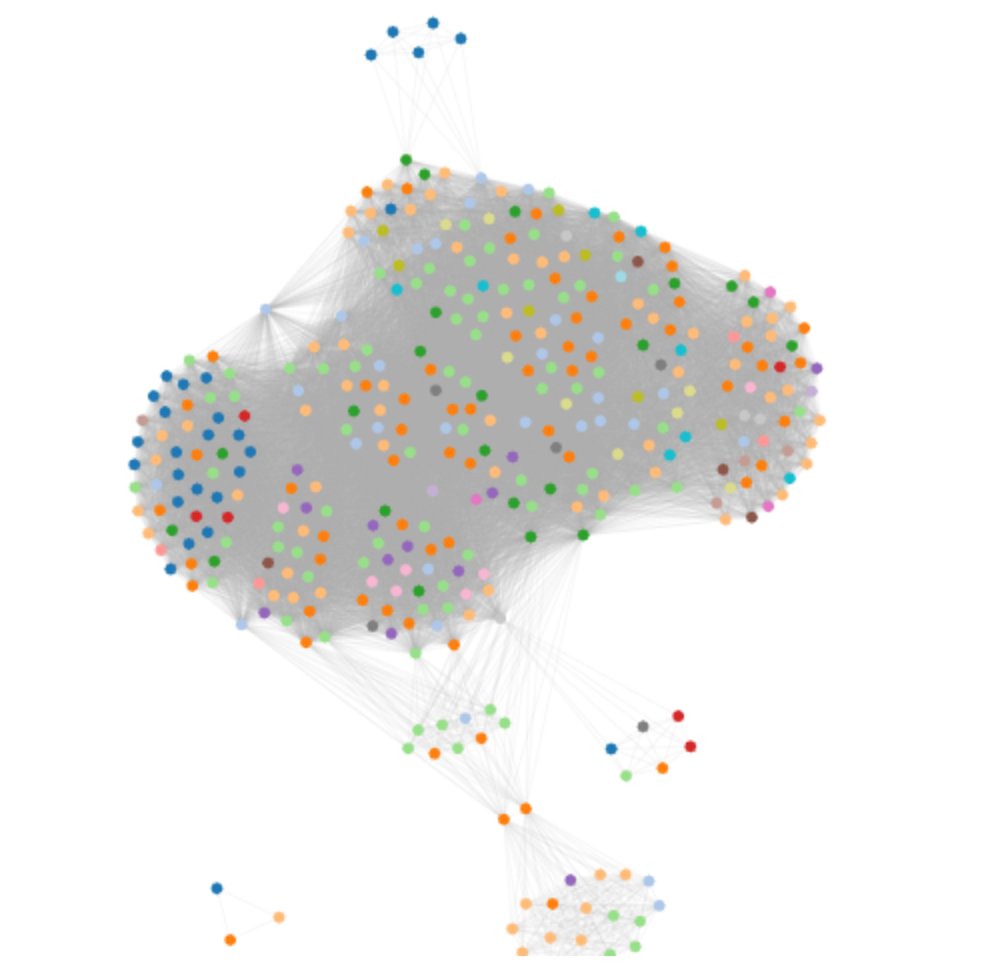

# d3V4ForceTutorial
A step by step tutorial on how to use the d3 v4 forceSimulation system, to create network visualizations using canvas.

[Video tutorial en español](https://youtu.be/te3MYUBD0m8)

You can follow the tutorial by looking at the [releases](./releases)

